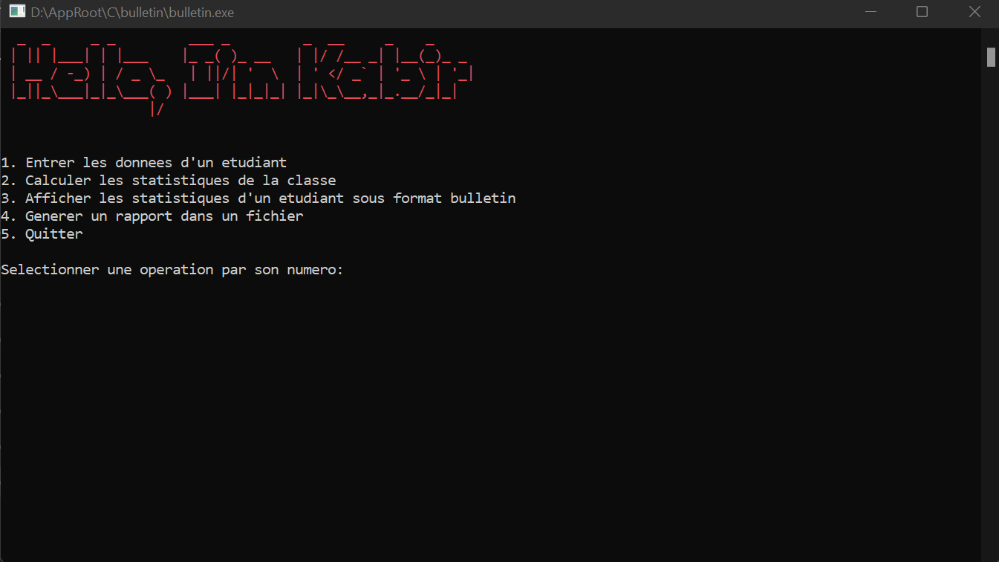

# c-bulletin-console-app-exemple

Ce projet est un petit programme console en C pour effectuer des operations de calcules sur les notes, moyennes et affichage sous format bulletin ainsi que l'ecriture des resultats dans un fichier .txt

## Prérequis

- Connaissance de base en C
- Connaissance des `stuctures` en C, `des tableaux` et de la notion de `pointeur`.

## Fonctionnalités

- Entrer les informations(Nom, Prenom, Note) d'un etudiant.
- Calculer les statistiques de la classe.
- Afficher les statistiques d'un etudiant sous format bulletin
- Generer un rapport dans un fichier

## Repertoires

- `Includes/`: Contient tout les fichiers d'en tête, allant de la declaration des constantes et des prototypes des fonctions à utiliser.
- `Sources`: Contient les fichiers c de toutes les fonctions utiliser dans le main du projet.

## Fichiers

- `main.c` : Contient le code de la fontion `main`.
- `Sources/functions.c` : Contient le code des fonctions du projet.
- `Sources/hello.c` : Contient le code de la function `say_hello()` qui permet d'afficher au tout debut du programme dans la console un message utiliser les codes ASCII le texte "Hello, I'm Kabir".
- `Sources/menu.c` : Contient le code de la function `print_menu()` permettant d'afficher le menu de choix de l'operation à effectuer.

## Comment utiliser

### Utiliser le code sources pour compiler soit meme

- Veuillez cloner le repository Github sur votre ordinateur local
- Si compresser, alors decompresser le.
- ouvrez le fichier `main.c` à la racine du projet.
- Ou simplement faire la commande `gcc -o bulletin.exe main.c` avec le chemin correcte de `main.c`.

### Utiliser le binaire déjà compilé

- Telecharger le fichier .exe dans la section `Releases` du repository GitHub
- double clicker sur le fichier `bulletin.exe` apres decompression.

## Personnalisation

Vous pouvez personnaliser le projet en modifiant la ou les fonctions concernés.
Essayer peut-etre de le connecter à une base de donnees SQLite pour stocker les informations des etudiant de façons persistante et effectuer directement les recherches dans la BDD.

## Licence

Ce projet est sous licence MIT.

